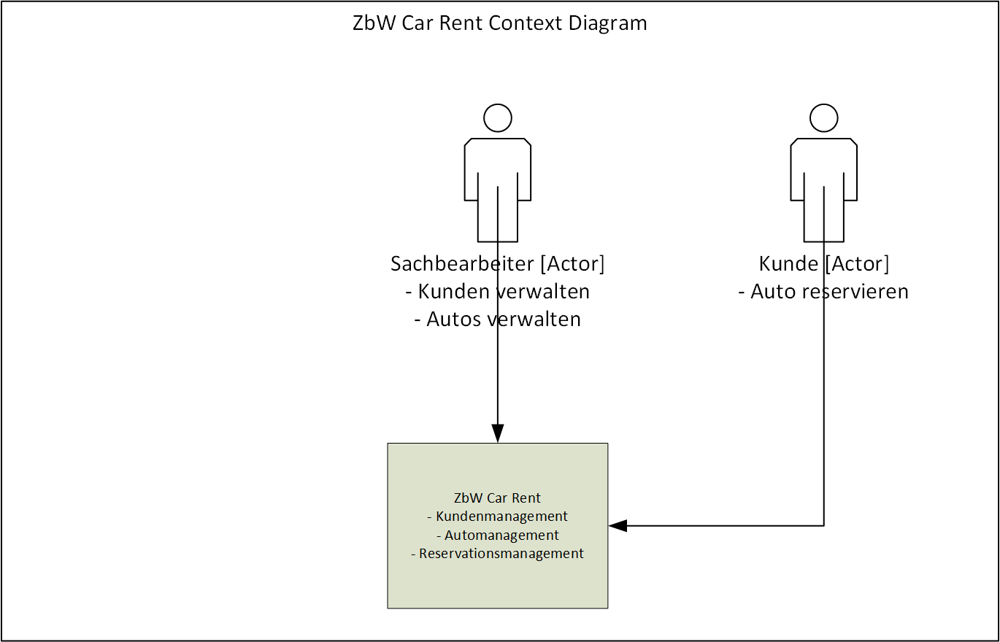
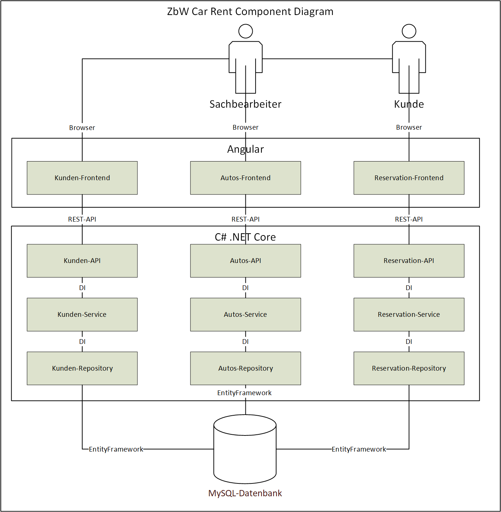
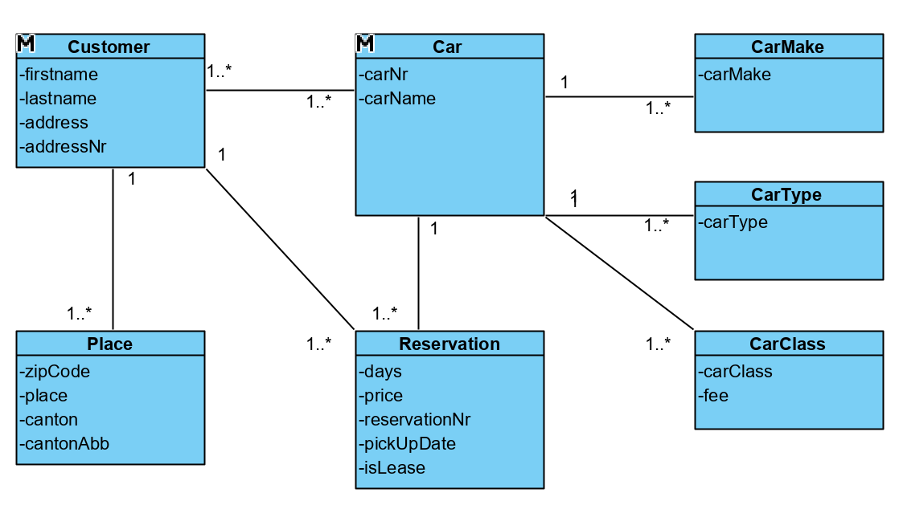
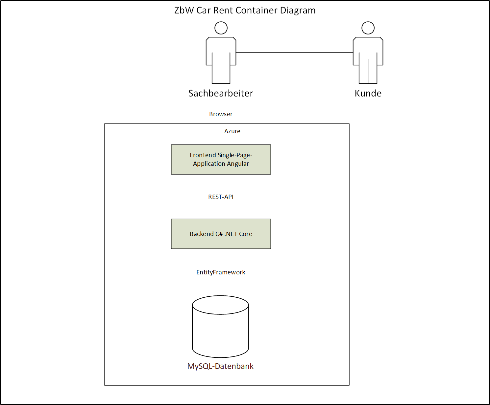
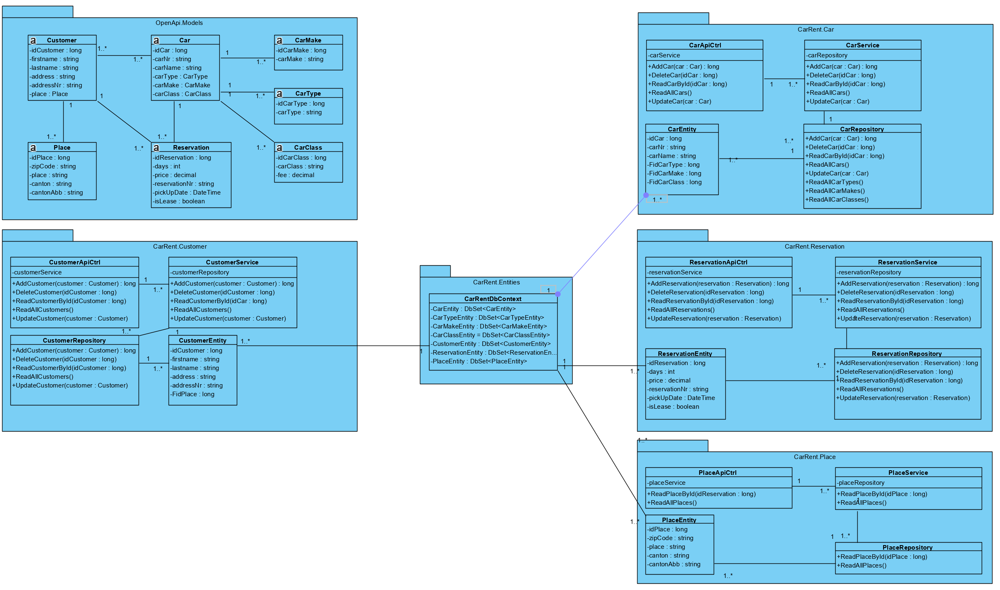

# Autovermietungssystem Car-Rent

Diese Dokumentation wurde auf der Grundlage von arc 42 erstellt.

**Über arc42**

arc42, das Template zur Dokumentation von Software- und
Systemarchitekturen.

Erstellt von Dr. Gernot Starke, Dr. Peter Hruschka und Mitwirkenden.

Template Revision: 7.0 DE (asciidoc-based), January 2017

© We acknowledge that this document uses material from the arc 42
architecture template, <http://www.arc42.de>. Created by Dr. Peter
Hruschka & Dr. Gernot Starke.

## Einführung und Ziele

### Aufgabenstellung
Es soll ein neues Autovermietungssystem „CarRent“ erstellt werden. Das System soll aus einem Server-Teil und
optional einen Web-Client bestehen.
1. Die Daten sollen mittels Repository Pattern in eine Datenbank gespeichert werden können.
2. Die Business Logik soll auf dem Backend laufen und REST APIs anbieten.
3. Es soll zuerst ein Monolith erstellt werden und später auf eine Micro Service Architektur überführt
werden.
Optional:
4. Der Web-Client benutzt die REST API um die Funktionen auszuführen.

### Qualitätsziele
* Performance
* Datenqualität
* Benutzerfreundlichkeit
* Installierbarkeit
* Erweiterbarkeit
* Wartbarkeit
* Stabilität

### Stakeholder
| Rolle | Name| Erwartungshaltung |
| :--- | :----: | ---: |
| Sacharbeiter | John Mega | Performance, Benutzerfreundlichkeit |
| Kunde | Andrea Super | Performance, Benutzerfreundlichkeit |
| Owner | Tim Top | Stabilität, Datenqualität |
| Entwickler | Evoltafreak | Installierbarkeit, Wartbarkeit, Erweiterbarkeit |

## Randbedingungen
### Developer Tools
* JetBrains Rider
* JetBrains WebStorm
* MySql Workbench

### Frontend
* Angular
* Angular Flex-Layout
* Angular Material

### API
* .NET Core 2.2
* EntityFramework

### Testing
* NUnit

### Database
* MySQL 8.0.16             

## Kontextabgrenzung
### Fachlicher Kontext

### Technischer Kontext

## Domain Model

## Deployment Diagram

## Klassendiagramm

